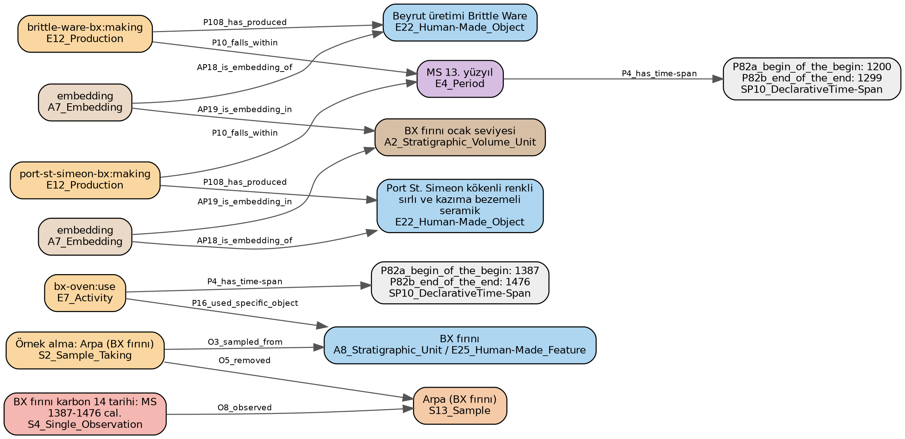

# Kazı Verisi İçin Ortak Bir Yapı: CIDOC CRM ile Uyumlu, Veriyi Kazı Ekibinin Elinde Tutan Bir Yöntem

**Doktora tez önerisi taslağı — görüşünüzü almak içindir**

Hazırlayan: Tuğçe Köseoğlu
Sunulan: Prof. Dr. Çiler Çilingiroğlu, Ege Üniversitesi, Arkeoloji Bölümü
Tarih: 29 Eylül 2026

## 1. Şu anda ne üzerinde çalışıyorum

Bir kazının ürettiği bilginin büyük kısmı yayımlanmaz. Yayımlanan rapor damıtılmış bir özettir; asıl veri kazının kendi dosyalarında, çoğunlukla Excel tablolarında, açma defterlerinde ve fotoğraf klasörlerinde kalır. Her kazı bu dosyaları kendi alışkanlığına göre düzenler. Bu nedenle bir kazının verisini devralan araştırmacı, onu anlamak için uzun zaman harcar; iki kazının verisini yan yana koymak ise çoğu zaman mümkün olmaz.

Üzerinde çalıştığım şey, bu veriyi taşıyabilecek ortak bir yapıdır. Yapının üç özelliği olmasını istiyorum. Birincisi, arkeoloğun alıştığı tablo görünümünü koruması ve teknik bilgi gerektirmemesidir. İkincisi, arka planda uluslararası bir standarda, CIDOC CRM'e uyması ve böylece verinin başka sistemlerle konuşabilmesidir. Üçüncüsü, yayımlanmamış verinin kazı ekibinin denetiminden çıkmamasıdır.

Bu çalışmanın uzun vadeli hedefi bir TÜBİTAK 3005 proje başvurusudur. Belgenin büyük kısmı tezin kendisini anlatmaktadır; projeye ilişkin düşüncelerimi 9. bölümde özetledim.

## 2. İki temel kavram

### 2.1 CIDOC CRM nedir

CIDOC CRM, kültürel miras bilgisini tanımlamak için Uluslararası Müzeler Konseyi'nin (ICOM) belgeleme komitesi tarafından geliştirilen ve ISO standardı olan (ISO 21127) bir kavram modelidir. Bir yazılım ya da bir veritabanı değildir. Bir tür ortak dilbilgisidir: "kim, neyi, nerede, ne zaman, hangi olayda" sorularının nasıl ifade edileceğini belirler.

Modelin temel fikri, bilgiyi olaylar üzerinden kurmaktır. Bir Excel satırında "kandil, C3 açması, Roma Dönemi" yazar. CIDOC CRM aynı bilgiyi şöyle ifade eder: bir nesne vardır; bu nesne bir kazı etkinliği sırasında, belirli bir tabakada bulunmuştur; bir kişi bu nesneyi belirli bir gerekçeyle Roma Dönemi'ne tarihlemiştir. Fark şudur: ikinci ifadede tarihlemenin bir gözlem değil bir yorum olduğu, kimin yaptığı ve neye dayandığı da kayıtlıdır.

Çekirdek modelin arkeolojiye özgü ekleri vardır. CRMarchaeo kazıyı ve tabakalanmayı, CRMsci örnek alma ve laboratuvar analizini, CRMgeo konumu ve koordinatı, CRMinf ise yorumu ve gerekçesini tanımlar. Avrupa'daki arkeolojik veri altyapısı ARIADNE bu model üzerine kuruludur.

Modelin zorluğu, doğrudan kullanılamamasıdır. Uzmanlık ister ve aynı bilgiyi birkaç farklı biçimde ifade etmeye izin verir. Bu yüzden iki kurum da standarda uyduğu hâlde verileri birbiriyle karşılaştırılamayabilir.

### 2.2 FAIR ilkeleri nedir

FAIR, araştırma verisinin nasıl yönetilmesi gerektiğini tanımlayan ve 2016'da yayımlanan dört ilkenin baş harfleridir. Veri bulunabilir olmalıdır (Findable): kalıcı bir tanımlayıcısı ve tanımı olmalıdır. Erişilebilir olmalıdır (Accessible): ona nasıl ve hangi koşulla ulaşılacağı açık olmalıdır. Birlikte çalışabilir olmalıdır (Interoperable): ortak bir dil ve ortak sözlükler kullanmalıdır. Yeniden kullanılabilir olmalıdır (Reusable): lisansı, kaynağı ve nasıl üretildiği belli olmalıdır.

FAIR, açık veri ile aynı şey değildir. Bir veri seti ambargolu ya da erişime kapalı olabilir ve yine de FAIR olabilir; yeter ki var olduğu bilinsin ve erişim koşulu yazılı olsun. Bu ayrım bu tez için önemlidir, çünkü kazı başkanının yayın hakkı ile verinin düzenli saklanması birbiriyle çelişmez.

CIDOC CRM, FAIR'in "birlikte çalışabilir" ilkesini arkeolojide karşılamanın yoludur. Avrupa'da bu yönde kurumsal altyapılar vardır. Türkiye'de kazı verisi için yerleşik bir standart, kılavuz ya da araç şu ana kadar bulamadım. [TODO: Türkçe literatür taraması; TAY ve MUES'in ayrıntılı incelenmesi]

## 3. Önerdiğim yapı ve yöntem

### 3.1 Temel fikir

Arkeolog CIDOC CRM'i öğrenmek zorunda kalmamalıdır. Önerdiğim çözüm, standardı veritabanının içine yerleştirmektir. Arkeolog alışık olduğu bir tabloyu doldurur: buluntu listesi, tabaka listesi, yontmataş sayım tablosu. Her sütunun CIDOC CRM'deki karşılığı önceden ve bir kez belirlenmiştir. Standarda uygun çıktı, veritabanından kendiliğinden üretilir.

Yapı sabittir. Yeni bir kazı geldiğinde yeni tablo ya da sütun eklenmez. Hedef, bir kazının kaydettiği bilginin en az yüzde 95'ini bu sabit yapının içinde, karşılaştırılabilir biçimde tutmaktır.

### 3.2 Yapının nasıl tasarlandığı

İlk denemede yapıyı kazı raporlarından türettim ve her yeni raporda yapı bozuldu. Bu nedenle yönü tersine çevirdim: yapı artık standardın kendisinden türetiliyor, raporlar ve kazı kayıtları ise yalnızca sınama malzemesi olarak kullanılıyor.

Yapı, her biri standardın bir bölümünü izleyen modüllerden oluşur. Çekirdek modül her kazıda bulunan şeyleri tutar: kişiler, yerler, dönemler, etkinlikler, nesneler ve ölçümler. Bunun üzerine kazı ve tabakalanma, örnek ve analiz, yorum ve gerekçe, konum, kaynak ve belgeleme modülleri gelir. Bir modül kullanılmayabilir; laboratuvar çalışması olmayan bir kazıda analiz modülü boş kalır ve başka hiçbir şey değişmez.

### 3.3 Arkeolojik açıdan önemli üç karar

**Gözlem ile yorum ayrı tutulur.** "Bu tabakada şu buluntu vardı" bir kayıttır. "Bu yapı Geç Roma Dönemi'ne aittir" bir yorumdur. Yapı, her yorumun kim tarafından, neye dayanarak ve ne kadar kesinlikle yapıldığını kaydeder. Aynı konu hakkında çelişen iki yorum birlikte saklanır. "Muhtemelen" denilerek söylenen bir şey kesin bilgi olarak kaydedilmez.

**Dönem bir ad değil, bir tanımdır.** "Neolitik" sözcüğü farklı bölgelerde ve farklı yazarlarda farklı yılları ifade eder. Bu yüzden her dönem, onu kimin tanımladığı, hangi bölge için geçerli olduğu ve hangi yılları kapsadığı ile birlikte saklanır.

**Kazının kendi terimleri korunur.** Kazı ekibinin kullandığı terim olduğu gibi saklanır ve yanına, varsa, ortak sözlükteki karşılığı eklenir. Ekip, kimseden izin almadan kendi terimini ya da kendi sütununu ekleyebilir. Bu eklemeler yalnızca o kazı içinde karşılaştırılabilir kalır; birçok kazının kullandığı bir ekleme sonradan ortak sözlüğe alınabilir.

### 3.4 Başarının nasıl ölçüleceği

Kapsamayı şöyle ölçmeyi öneriyorum. Önce, yapıyı hiç görmemiş bir okuyucu kaynaktaki bütün ifadeleri listeler. Sonra her ifadenin yapıda nereye düştüğüne bakılır. Dört sonuç mümkündür: ifade karşılaştırılabilir biçimde saklanmıştır; yalnızca kazının kendi eklemesiyle saklanmıştır; yalnızca serbest metin olarak saklanmıştır; ya da hiç saklanamamıştır. Her kayıp için neyin düştüğü, neden düştüğü ve geri kazanılıp kazanılamayacağı yazılır. Bu kayıp dökümü, tezin bulgularından biri olacaktır.

## 4. Dil modelleri ve veri egemenliği

Dağınık kayıtları bu yapıya elle aktarmak çok zaman alır. Büyük dil modelleri bu işi hızlandırabilir. Önerdiğim yöntemde modelin görevi sınırlıdır: model yalnızca tablolardaki değerleri doldurur. Hangi bilginin standartta neye karşılık geldiğine model karar vermez; bu karar yapının içinde sabittir. Veritabanı, modelin hatalı girişini bir insanın hatalı girişi gibi reddeder.

Sorun şudur: en başarılı modeller yurt dışındaki şirketlerin sunucularında çalışır. Yayımlanmamış kazı verisi bu sunuculara gönderildiğinde, veri üzerindeki denetim kazı ekibinin elinden çıkar. Bu, yayın hakkı ve ulusal miras açısından kabul edilebilir değildir.

Bu nedenle tezin ikinci sorusu şudur: aynı iş, araştırmacının kendi sunucusunda çalışan açık kaynaklı modellerle ne ölçüde yapılabilir? Bunu ölçmek için, bir arkeoloğun elle işaretlediği bir karşılaştırma kümesi üzerinde yerel modelleri en başarılı modelle kıyaslayacağım. "Benzer sonuç" ifadesi ölçümden önce sayısal bir eşik olarak tanımlanacaktır. Aradaki farkı kapatabilecek her yol ayrı ölçülecektir: soruların ve yapının tasarımı, modele ilgili belgelerin verilmesi, çıktının biçiminin zorunlu tutulması, modelin arkeoloji metinleriyle eğitilmesi ve insan denetimi. Türkçe metinlerdeki başarım ayrı bir değişken olarak izlenecektir.

[TODO: karşılaştırma kümesinin boyutu ve kimin işaretleyeceği] [TODO: sayısal eşik] [TODO: sunucu kurulumu ve aday modeller] Bu bölümdeki ölçümlerin hiçbiri henüz yapılmamıştır.

## 5. Araştırma tasarımı

Çalışma üç aşamadan oluşur.

**Birinci aşama: yayımlanmış veriyle ön çalışma.** Yapıyı ve iş akışını kurmak için Kazı Sonuçları Toplantısı ciltlerini kullanıyorum. Bu metinler yayımlanmış ve herkese açık olduğu için, bu aşamada en başarılı modelleri kullanmakta bir sakınca yoktur. Bu aşama yapıyı, iş akışını ve ulaşılabilecek en yüksek başarımı verir. Höyük, klasik kent ve mağara gibi farklı yerleşim türleri yapının dayanıklılığını sınar.

**İkinci aşama: yayımlanmamış kazı kaydıyla aktarım denemesi.** Onayınız olursa Karaburun kayıtlarını kullanmak istiyorum. Yapı yayımlanmış düzyazı üzerinde tasarlandı ve burada gerçek kazı kaydı üzerinde sınanacak. Yapının burada da çalışacağı bir varsayımdır. Nerede bozulduğu başlı başına bir bulgudur. [TODO: kayıtların biçimi ve kapsamı]

**Üçüncü aşama: yerel modellerle çalıştırma.** Aynı karşılaştırma kümeleri bu kez yalnızca yerel modellerle işlenir ve sonuçlar birinci aşamadaki en yüksek başarımla kıyaslanır.

## 6. Ön çalışmanın bugünkü durumu

45. Kazı Sonuçları Toplantısı cildindeki 26 bildiriden dördünü işledim: Seleukeia Sidera, Yumuktepe, Sinekkaya ve Zerzevan Kalesi. Sonuçlar şöyledir.

Rapordan veritabanına, veritabanından CIDOC CRM çıktısına kadar bütün adımlar çalışmaktadır ve üretilen çıktıda standarda aykırı hiçbir ifade yoktur. Yapıyı kurarken kullandığım üç bildiride bilginin yüzde 84 ile 89'u karşılaştırılabilir biçimde saklanmıştır. Yapıyı hiç değiştirmeden denediğim dördüncü bildiride bu oran yüzde 72'dir. Yüzde 95 hedefine henüz ulaşılmamıştır.

Eksiğin büyük kısmı yapıdan değil sözlükten kaynaklanmaktadır. Dördüncü bildiride kazının kendi eklemesiyle saklanan 317 ifadenin 255'inde tablo ve sütun mevcuttu; yalnızca terim ortak sözlükte yoktu. "Ok ucu", "ağırşak", "pişmiş toprak" gibi terimler bunlara örnektir. Bu, Türkçe bir arkeoloji sözlüğünün bu işin asıl emeği olduğunu göstermektedir.

Yapı, kimsenin aramadığı tutarsızlıkları da ortaya çıkarmıştır. Yumuktepe'de BX fırını radyokarbon ile MS 1387–1476 arasına tarihlenmiştir; aynı fırının ocak seviyesinden gelen iki seramik grubu ise 13. yüzyıla tarihlenmiştir (Şekil 1). Sinekkaya'da yontmataş tablosunun basılı toplamı 677'dir, hücrelerin toplamı ise 676'dır.

Bu sonuçların sınırları açıktır. Dört bildiri tek bir cilde aittir. Bilgiyi metinden çıkaran bir dil modelidir ve hiçbir arkeolog sonuçları bildirilerle karşılaştırmamıştır. Gerçek kazı kaydı henüz yüklenmemiştir. [TODO: ön çalışmada kullanılan modelin adı ve sürümü]

## 7. Hipotez

Hipotezin sınanabilir kısmı şudur: CIDOC CRM ile uyumlu bir ilişkisel yapı, birbirine benzemeyen kazı verileri arasındaki farklılığı belirgin biçimde azaltır. Bunu, yeni bir kazının yapıda zorunlu kıldığı değişikliklerin sayısı ve karşılaştırılabilir biçimde saklanan bilginin oranı ile ölçeceğim.

Hipotezin tartışma bölümünde savunulacak kısmı şudur: böyle bir yapı, Türkiye arkeolojisinde veri paylaşımının önündeki uygulamaya dönük bir engeli düşürür. Bu savı tez kendi başına kanıtlayamaz; literatür ve mevzuat üzerinden tartışılacaktır.

## 8. Tez taslağı

1. Giriş ve araştırma soruları
2. Kavramlar: CIDOC CRM, FAIR, açık erişim, ilişkisel veritabanı ve elektronik tablo
3. Önceki çalışmalar: Avrupa ve ARIADNE; Türkiye, TAY ve MUES; arkeolojide büyük dil modelleri
4. Neden yerel dil modelleri: veri sızıntısı ve veri egemenliği
5. Yöntem
6. Bulgular
7. Tartışma
8. Sonuç

## 9. Tezi destekleyecek proje: TÜBİTAK 3005

### 9.1 Program ve modül

TÜBİTAK 3005 programı 10 Eylül 2026'da iki modül olarak yeniden açılmıştır. Her iki modülde de proje süresi en fazla 24 ay, destek üst sınırı burslar hariç 1.200.000 TL'dir ve başvuru yıl boyunca yapılabilmektedir. Modülün amacına uymayan öneriler bilimsel değerlendirmeye alınmadan iade edilmektedir.

Başvuruyu 3005-B, Teknolojik İlerlemelerin Toplumsal Etkileri Modülü'ne yapmayı öneriyorum. Bu modül, yüksek teknolojilerin toplumsal etkilerini mühendislik bilimleriyle eş güdüm içinde ele alan ve toplumsal fayda hedefleyen sosyal ve beşeri bilimler araştırmalarını desteklemektedir. Diğer modül olan 3005-A, bir kamu kurumuyla birlikte doldurulmuş bir iş birliği formu istemektedir; 3005-B'de böyle bir koşul yoktur.

### 9.2 Projenin savı

Proje, yapay zekânın arkeologların gündelik çalışmasında neyi değiştirdiğini ölçecektir. Bir araç tanıtmak yeterli değildir, çünkü modül teknolojinin insanlar üzerindeki etkisini sormaktadır. Bu nedenle proje şu soruları ölçülebilir biçimde soracaktır: Bir araştırmacı başka bir kazının verisini anlamak için ne kadar zaman harcıyor ve ortak yapı bu süreyi kısaltıyor mu? Teknik eğitimi olmayan bir kazı ekibi, verisini dışarıya vermeden dil modellerinden yararlanabiliyor mu? Yayımlanmamış miras verisinin yurt dışındaki yapay zekâ hizmetlerine gönderilmesi nasıl bir risk oluşturuyor ve bunun sınanmış bir alternatifi var mı?

### 9.3 Tez ile proje arasındaki iş bölümü

Tez araştırma sorusunu sorar; proje ise tek bir doktora öğrencisinin yapamayacağı işleri karşılar. Proje kabul edilmese de tez kendi başına savunulabilir olmalıdır.

| Tezde kalan | Projenin eklediği |
|---|---|
| Yapının tasarımı ve standarttan nasıl türetildiği | Kayıtları kaynaklarla karşılaştıracak arkeologlar (bursiyer) |
| Kapsama ölçütü ve kayıp dökümü | Türkçe arkeoloji sözlüğünün oluşturulması |
| Yerel modellerin en başarılı modellerle kıyaslanması | Daha çok sayıda kazı ile sınama |
| Karaburun verisi üzerinde aktarım denemesi | Gerçek kazı ekiplerinin yapıyı kullanması; sunucu ve donanım |

Sağ sütundaki her madde, ön çalışmanın bugünkü bir eksiğine karşılık gelmektedir: sonuçları henüz hiçbir arkeolog denetlememiştir, kaybın çoğu eksik terimlerden kaynaklanmıştır ve tabloları henüz hiç kimse kullanmamıştır.

### 9.4 Proje ekibi

Programın kurallarına göre proje yürütücüsünün doktora derecesine sahip ve kadrolu olması gerekmektedir; doktora öğrencileri yürütücü olamaz, bursiyer olarak yer alabilir. Bu nedenle projenin yürütücülüğünü sizin üstlenmenizi rica ediyorum. Ben projede doktora bursiyeri olarak yer alırım.

Modül mühendislik bilimleriyle eş güdüm istediği ve yöntemin yarısı dil modelleriyle ilgili olduğu için, ekipte bilgisayar mühendisliğinden bir araştırmacı bulunması gerektiğini düşünüyorum. Kurallar bunu zorunlu tutmuyor; ancak yalnızca arkeologlardan oluşan bir ekip modülün amacını kâğıt üzerinde karşılamayabilir. Bir danışman da olabilir, fakat ekipte yer alan bir araştırmacı daha güçlü bir işaret verir.

Mühendislik tarafında Ege Üniversitesi Bilgisayar Mühendisliği Bölümü Başkanı Prof. Dr. Murat Osman Ünalır ile ilerliyoruz. Çalışma alanları ontoloji mühendisliği, anlamsal ağ, bilgi gösterimi, birlikte çalışabilirlik ve makine öğrenmesidir; bu, çalışmamın her iki yarısıyla da örtüşmektedir. Programın kuralına göre profesör unvanlı kişiler projede araştırmacı olarak görev alamamaktadır. Bu nedenle Ünalır hoca projede danışman olarak yer alabilir; araştırmacı görevi için kendi grubundan bir öğretim üyesinin katılması uygun olur.

| Görev | Kişi |
|---|---|
| Proje yürütücüsü | Prof. Dr. Çiler Çilingiroğlu |
| Danışman | Prof. Dr. Murat Osman Ünalır, bilgisayar mühendisliği |
| Araştırmacı | Bilgisayar mühendisliğinden bir öğretim üyesi; belirlenecek |
| Doktora bursiyeri | Tuğçe Köseoğlu |
| Diğer bursiyerler | Kayıtları denetleyecek arkeoloji öğrencileri |

[TODO: bütçe] [TODO: iş paketleri ve takvim] [TODO: araştırmacı adı]

## 10. Size sorularım

1. **Standardın ekleri.** Yapı, çekirdek modelin yanında kazı, analiz, konum ve yorum eklerini (CRMarchaeo, CRMsci, CRMgeo, CRMinf) kullanıyor. Bu kapsamı bir doktora tezi için uygun buluyor musunuz?
2. **Karaburun verisi.** Bu kayıtları tezde kullanmama izin verir misiniz? Veri yalnızca kendi sunucumda tutulacak ve onayınız olmadan hiçbir şey yayımlanmayacaktır.
3. **Eş danışman.** Tezin dil modeli ve ölçüm kısmı için Ünalır hocanın ikinci tez danışmanı olmasını uygun bulur musunuz?
