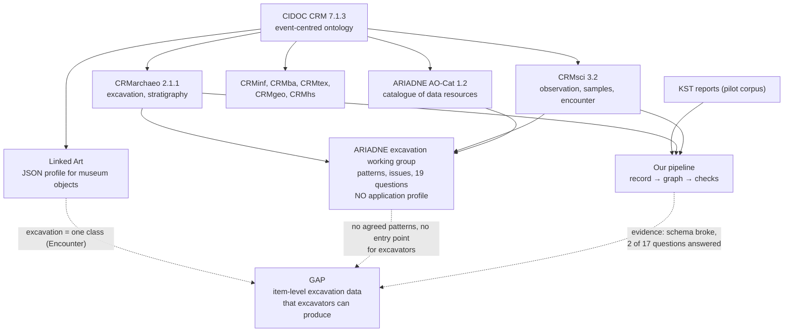

# Excavation data sharing: bibliography and synthesis

Working document, 2026-09-29, second revision the same day after a search for recent work. Purpose: put every source consulted so far in one
place, show how the sources and our own experiments connect, and end with
candidate problem statements to choose from.

**How to read the status column**

| Mark | Meaning |
| --- | --- |
| READ | Original text read directly, in full or in the sections named |
| SUMMARY | Read through an automated summary of the web page. Quotations must be checked against the original before they are cited |
| ABSTRACT | Only the published abstract was read, because the publisher blocked access to the full text |
| TOC | Only the table of contents was read |
| LISTED | Found in another source's reference list. Not opened. Details are as printed there |

Nothing in this file should be cited in the thesis from this file alone.
Every entry carries a DOI or URL so the original can be opened.

---

## 1. The landscape in one picture

The same picture in words:

- **The ontologies exist and are rich.** CIDOC CRM with its extensions can express nearly everything an excavation produces.
- **Two profiles sit on top of them.** Linked Art makes CRM easy to publish as JSON, but for museum objects. ARIADNE makes archaeological *datasets* findable, but describes the dataset, not its contents.
- **The middle is empty.** Nobody has fixed how contexts, finds, samples and their relations should be written, and nobody offers excavators a way in that does not require learning CRM.
- **Our experiments landed in that gap.** They show its consequences with numbers.

---

## 2. Bibliography

### A. Ontologies and standards

| ID | Reference | Status | What it gives us |
| --- | --- | --- | --- |
| A1 | CIDOC CRM Special Interest Group. *Definition of the CIDOC Conceptual Reference Model*, version 7.1.3, February 2024. Listed as the official version with ISO correspondence. https://www.cidoc-crm.org/versions-of-the-cidoc-crm | SUMMARY | The backbone. Classes and properties used in both our graphs. Editors and the ISO edition number still need to be taken from the specification PDF |
| A2 | CIDOC CRM Special Interest Group. *CRMarchaeo: the Excavation Model*, version 2.1.1, April 2024. Namespace `http://www.cidoc-crm.org/extensions/crmarchaeo/` | SUMMARY | Excavation (A9), excavation processing unit (A1), stratigraphic units (A2, A3, A8), embedding (A7), physical relation (AP11). Version 2 renamed A1 and changed AP3, which broke our first draft |
| A3 | CIDOC CRM Special Interest Group. *CRMsci: the Scientific Observation Model*, version 3.2, May 2026. Namespace `http://www.cidoc-crm.org/extensions/crmsci/` | SUMMARY | Encounter event (S19), sample (S13), sample taking (S2), observation (S4), measurement by sampling (S3) |
| A4 | Paveprime and collaborators. 2019. *CRMinf: the Argumentation Model*, version 0.10.1. https://cidoc-crm.org/crminf/sites/default/files/CRMinf%20ver%2010.1.pdf | LISTED | The formal way to model arguments and beliefs. We used the simpler E13 Attribute Assignment instead. Needs reading before we decide how to model interpretation |
| A5 | Ronzino, P., Niccolucci, F., Felicetti, A. et al. 2016. CRMba, a CRM extension for the documentation of standing buildings. *International Journal on Digital Libraries* 17, 71–78. https://doi.org/10.1007/s00799-015-0160-4 | LISTED | Standing structures. Relevant to classical sites such as Seleukeia Sidera, where most "contexts" are buildings |

### B. Linked Art

| ID | Reference | Status | What it gives us |
| --- | --- | --- | --- |
| B1 | Linked Art. *Model documentation*: overview, basic patterns, profile, assertions, conservation, production. https://linked.art/model/ | SUMMARY | Design rules worth copying: one ontological type plus open vocabulary in `classified_as`; small structures embedded; activities split into parts instead of roles on properties |
| B2 | Linked Art. *API 1.0: design principles and record types*. https://linked.art/api/1.0/ | SUMMARY | Record boundary rules: embed what is one-to-one and never referenced from outside; write each relation once, from the many to the one; JSON Schema per record type |
| B3 | Linked Art. *Encounters with Objects*. https://linked.art/model/provenance/encounters/ | SUMMARY | The whole of Linked Art's excavation coverage: one class, one example, a statue found in 1964 |
| B4 | Linked Art. *JSON-LD context v1*. https://linked.art/ns/v1/linked-art.json | SUMMARY | Declares a CRMarchaeo prefix but maps no terms to it. Uses older CRMsci and CRMarchaeo namespace URIs than the current official ones |

### C. ARIADNE

| ID | Reference | Status | What it gives us |
| --- | --- | --- | --- |
| C1 | Felicetti, A., Meghini, C., Richards, J., Theodoridou, M. 2023. *The AO-Cat Ontology*, v1.2. https://doi.org/10.5281/zenodo.7818375 | READ (section 3, property appendix) | The catalogue specification: classes, 66 properties, which are mandatory. Basis of our coverage test |
| C2 | Richards, J., Felicetti, A., Meghini, C., Theodoridou, M. 2022. *ARIADNEplus D4.4: Final report on ontology implementation*. https://doi.org/10.5281/zenodo.7636720 | READ (sections 3, 4.5, 4.12, 5) | States that AO-Cat is stable. Section 5 is the excavation case study: the list of excavation entities and the decision not to write an application profile |
| C3 | Katsianis, M., Nenova, D. 2022. *Archaeological Excavation Modelling Working Group: WP 4.4.12 excavation data. Final report*, with Annexes A to D. https://doi.org/10.5281/zenodo.7377910 | READ (report, Annex A, C, D); TOC (Annex B) | The central source. Annex B: modelling recipes. Annex C: unresolved problems in CRMarchaeo. Annex D: 19 questions that excavation data should answer. All annexes are drafts, version 0.6 |
| C4 | Katsianis, M., Bruseker, G., Nenova, D., Marlet, O., Hivert, F., Hiebel, G., et al. 2023. Semantic Modelling of Archaeological Excavation Data. A review of the current state of the art and a roadmap of activities. *Internet Archaeology* 64. https://doi.org/10.11141/ia.64.12 | SUMMARY | The published version of C3. Names 22 core entities of excavation data. States that documentation targets modellers, not archaeologists, and that CRM updates burden projects. Full author list to be taken from the DOI |
| C5 | Richards, J. D. 2023. Joined up Thinking: Aggregating archaeological datasets at an international scale. *Internet Archaeology* 64. https://doi.org/10.11141/ia.64.3 | SUMMARY | What a provider has to do to contribute, and how much effort it took |
| C6 | Bardi, A., Baglioni, M., Artini, M., Mannocci, A., Pavone, G. 2024. The ARIADNEplus Knowledge Base: a Linked Open Data set for archaeological research. *SEBD 2024*, CEUR Workshop Proceedings 3741, paper 16. https://ceur-ws.org/Vol-3741/paper16.pdf | READ | The aggregation pipeline step by step. About 4 million resources, 59 publishers, February 2024 |
| C7 | Katsianis, M., Styliaras, G. 2022. *Virtual Workshop on Semantic mapping of archaeological excavation data*. https://doi.org/10.5281/zenodo.7112918 | LISTED | Presentations and report of the June 2022 workshop. Includes "An approach to model archaeological data and create RDF from spreadsheets" and "Archaeological Interactive Report", both close to our aim |
| C8 | Nenova, D., Bruseker, G., Derudas, P., Hiebel, G., Hivert, F., Katsianis, M., Marlet, O., Opitz, R., et al. 2022. *Bringing Excavation Data Together. Are We There Yet and Where is That?* Presentation, EAA 2022. https://doi.org/10.5281/zenodo.7117049 | LISTED | Short statement of the problem by the working group itself |
| C9 | Felicetti, A. 2022. *ARIADNEplus D4.3: Final report on dataset integration*. https://doi.org/10.5281/zenodo.7612672 | LISTED | Development history of AO-Cat and the integration tools |
| C10 | Bardi, A., Fihn Marberg, J., Theodoridou, M. 2022. *ARIADNEplus D12.4: Final report on data integration*. https://doi.org/10.5281/zenodo.7506766 | LISTED | Aggregation infrastructure and item-level integration |
| C11 | Richards, J., Felicetti, A., Meghini, C., Theodoridou, M. 2020. *ARIADNEplus D4.2: Initial report on ontology implementation*. https://doi.org/10.5281/zenodo.4916299 | LISTED (downloaded) | Earlier state of the application profiles, including scientific data and dating |
| C12 | Niccolucci, F., Richards, J. 2019. *The ARIADNE Impact*. Archaeolingua. https://doi.org/10.5281/zenodo.4319058 | LISTED | Community size and background of the infrastructure |
| C13 | Hiebel, G., Danthine, B., Peralta Friedburg, M., Scherer-Windisch, M., et al. 2023. Prehistoric Mining Data: How to create Open Data from archaeological research for the ARIADNE community and beyond. *Internet Archaeology* 64. https://doi.org/10.11141/ia.64.8 | LISTED | A worked case of taking research data to ARIADNE |
| C14 | Kecheva, N. 2024. The first step towards FAIR-ness in Bulgarian archaeology: The Archaeological Map of Bulgaria in ARIADNE and ARIADNEplus. *Internet Archaeology* 67. https://doi.org/10.11141/ia.67.5 | LISTED | A national provider's experience. Useful as a comparison for Türkiye |

### D. Excavation data modelling literature

All entries in this group come from the working group's reference list (C3, Annex A). None has been opened yet. They are ordered by how directly they bear on our work.

| ID | Reference | Status | Why it matters to us |
| --- | --- | --- | --- |
| D1 | Vlachidis, A., Tudhope, D. 2012. A pilot investigation of information extraction in the semantic annotation of archaeological reports. *International Journal of Metadata, Semantics and Ontologies* 7(3), 222–235. https://discovery.ucl.ac.uk/id/eprint/1556223/ | READ | Rule-based extraction (GATE) from English grey literature into CIDOC CRM and its English Heritage extension. Measured against a hand-annotated gold standard: overall recall 0.51, precision 0.69, F 0.58. Recall was held back by missing vocabulary for finds and contexts. States that statements taken from report text are less reliable as facts than those from excavation datasets, and that their provenance must be kept |
| D2 | Marlet, O., Zadora-Rio, E., Buard, P.-Y., Markhoff, B., Rodier, X. 2019. The Archaeological Excavation Report of Rigny: An Example of an Interoperable Logicist Publication. *Heritage* 2, 761–773. https://doi.org/10.3390/heritage2010049 | ABSTRACT | Follows Gardin's logicist programme from the 1970s: a report is a chain from descriptive propositions to interpretative ones. Inference chains are mapped to CRMinf and the field records to CRM, CRMsci and CRMarchaeo. This is the established way to do what we did with attribute assignments. The report was restructured by its authors, not extracted from an existing text |
| D3 | Marlet, O., Francart, T., Markhoff, B., Rodier, X. 2019. OpenArchaeo for Usable Semantic Interoperability. ODOCH 2019 at CAiSE 2019. https://hal.archives-ouvertes.fr/hal-02389929 | LISTED | "Usable" interoperability for archaeologists. Same aim as ours |
| D4 | May, K. 2020. The Matrix: Connecting Time and Space in archaeological stratigraphic records and archives. *Internet Archaeology* 55. https://doi.org/10.11141/ia.55.8 | LISTED | Stratigraphic relations, the part our first schema lacked entirely |
| D5 | Binding, C., May, K., Tudhope, D. 2008. Semantic Interoperability in Archaeological Datasets: Data Mapping and Extraction via the CIDOC CRM. *ECDL 2008*, LNCS 5173. https://doi.org/10.1007/978-3-540-87599-4_30 | LISTED | Early attempt at cross-dataset excavation queries |
| D6 | Tudhope, D., Binding, C., May, K. 2008. Semantic interoperability issues from a case study in archaeology. *SIEDL 2008*, 88–99 | LISTED | Lists the interoperability problems found in practice |
| D7 | Hiebel, G., Aspöck, E., Kopetzky, K. 2021. Ontological Modeling for Excavation Documentation and Virtual Reconstruction of an Ancient Egyptian Site. *Journal on Computing and Cultural Heritage* 14(3), article 32. https://doi.org/10.1145/3439735 | LISTED | A complete excavation modelled in CRM |
| D8 | Giagkoudi, E., Tsiafaki, D., Papatheodorou, C. 2018. Describing and revealing the semantics of excavation notebooks. CIDOC 2018, Heraklion | LISTED | Narrative field records as a source, like our reports |
| D9 | Lukas, D., Engel, C., Mazzucato, C. 2018. Towards a Living Archive: Making Multi Layered Research Data and Knowledge Generation Transparent. *Journal of Field Archaeology* 43:sup1, S19–S30. https://doi.org/10.1080/00934690.2018.1516110 | LISTED | Çatalhöyük. An excavation in Türkiye with a long-running database |
| D10 | Wright, H. 2011. *Seeing Triple: Archaeology, Field Drawing and the Semantic Web*. PhD thesis, University of York. https://etheses.whiterose.ac.uk/2194/1/WrightThesis.pdf | LISTED | A thesis-length treatment. Useful as a model for structure |
| D11 | Nussbaumer, P., Haslhofer, B., Klas, W. 2010. *Towards Model Implementation Guidelines for the CIDOC Conceptual Reference Model*. Technical report, University of Vienna | LISTED | Why CRM is hard to implement consistently |
| D12 | Doerr, M., Hermon, S., Hiebel, G., Kritsotaki, A., Masur, A., May, K., Schmidle, W., Theodoridou, M., Tsiafaki, D. 2013. CRMarchaeo: Modelling Context, Stratigraphic Unit, Excavated Matter. 29th CRM-SIG Meeting, Heraklion | LISTED | Origin of CRMarchaeo |
| D13 | Lucas, G. 2002. *Critical approaches to fieldwork: contemporary and historical archaeological practice*. Routledge | LISTED | Theory of what excavation recording is. Background for the argument that records are perceptions, not facts |

### H. Recent work, 2021 to 2026

Found by a web search on 2026-09-29. This group changes the picture more than any other.

| ID | Reference | Status | Why it matters to us |
| --- | --- | --- | --- |
| H1 | Hariri, A. 2025. From Text to Triples: Large Language Models for Ontology-Aligned Annotation in Archaeology. *ER 2025 Companion Proceedings, Doctoral Consortium*, CEUR Workshop Proceedings 4099. https://ceur-ws.org/Vol-4099/ER25_DC_hariri.pdf | READ | **The closest work to ours.** A doctoral project in France that guides language models to produce CIDOC CRM triples from excavation documentation, with usability for non-technical archaeologists as a stated aim. Corpus: one site, the Hypogeum of the Dunes in Poitiers. Four tables so far (stratigraphic units, stone inventory, samples, excavation facts). Narrative text is planned for a later phase. Finding so far: a hand-curated subset of the ontology in the prompt works better than the full ontology or none. Evaluation: precision and recall per triple against expert annotation, a competency question score, and energy use |
| H2 | Hariri, A., Jean, S., Baron, M. 2025. Towards Automating RDF Extraction for Archaeological Knowledge Graphs with LLMs. *Database and Expert Systems Applications (DEXA 2025)*, Lecture Notes in Computer Science, 83–97. https://doi.org/10.1007/978-3-032-02049-9_6. Open copy: https://hal.science/hal-05237866 | LISTED (blocked) | The full paper behind H1. Must be read in the original before we state what is new in our work |
| H15 | Hariri, A., Jean, S., Baron, M. 2026. ASOS-CRM: Automated Semantic Scoping for CIDOC CRM Population. *Big Data Analytics and Knowledge Discovery (DaWaK 2026)*, Lecture Notes in Computer Science, 261–269. https://doi.org/10.1007/978-3-032-34896-8_21. Code: https://github.com/lias-laboratory/asos-crm and https://github.com/lias-laboratory/cidoccrm-llm-extractor, both MIT licensed | ABSTRACT not readable (paywall); repository README READ | Third paper of the same project. Automates the choice of the ontology subset that H1 made by hand: for each column of a CSV table it retrieves similar CIDOC CRM classes and properties with a multilingual embedding model, then keeps only combinations that satisfy the domain and range declared in the ontology. Input is tables, not narrative. Ontology is CIDOC CRM 7.1.3 alone, with no CRMarchaeo or CRMsci. Data are French and not published. Removes one difference we had claimed, see section 5 |
| H3 | Wang, Y., Zhang, M. 2025. CIDOC CRM-Based Knowledge Graph Construction for Cultural Heritage Using Large Language Models. *Applied Sciences* 15(22), 12063. https://doi.org/10.3390/app152212063 | LISTED | Same technique, wider cultural heritage domain |
| H4 | Leveraging Large Language Models for Classification of Cultural Heritage Domain Terms: A Case Study on CIDOC CRM. 2024. *Proceedings of the 24th ACM/IEEE Joint Conference on Digital Libraries*. https://doi.org/10.1145/3677389.3702562. Authors as recorded in Crossref: Xilong H., Junhan Z., Xiaoguang W.; name order to be checked | LISTED | Whether a model can choose the right CRM class for a term. The step where our own first draft went wrong |
| H5 | Kim, H. 2025. A Study on Archaeological Informatization Using Large Language Models: Proof of Concept for an Automated Metadata Extraction Pipeline from Archaeological Excavation Reports. *Korean Journal of Heritage: History & Science* 58(3), 34–61. https://doi.org/10.22755/kjchs.2025.58.3.34 | SUMMARY | Language model extraction from excavation reports in Korea. Target is report metadata, not item-level content. Shows the same need in another national report tradition |
| H6 | Lien-Talks, A. 2026. Evaluating Natural Language Processing and Named Entity Recognition for Bioarchaeological Data Reuse. *Heritage* 9(1), 35. https://doi.org/10.3390/heritage9010035 | ABSTRACT | Extraction from PDF reports held by the Archaeology Data Service, deliberately without large language models. Evaluated with 83 users on usefulness, time saved, accessibility, reliability and reuse. A model for how to evaluate with people |
| H7 | Hou, T., Li, Y., Hu, D., Shi, J., Lü, G. 2026. A data model for the spatialized integration of archaeological excavation information from prehistoric sites. *npj Heritage Science*. https://doi.org/10.1038/s40494-026-02316-x | ABSTRACT | A data model built from the structure of Chinese excavation reports: site, square unit, layer, feature, cultural period. Another model derived from one national report tradition, which is the approach our second paper showed to be fragile |
| H8 | Atalan Çayırezmez, N., Hacıgüzeller, P., Kalayci, T. 2021. Archaeological Digital Archiving in Turkey. *Internet Archaeology* 58. https://doi.org/10.11141/ia.58.20 | READ (sections 2, 3 and conclusions) | **The source for the Turkish context.** Legal framework, what excavators must submit, existing systems, and the absence of standards. Details in section 3 below |
| H9 | Vlachidis, A., Tudhope, D., Wansleeben, M. 2021. Knowledge-Based Named Entity Recognition of Archaeological Concepts in Dutch. *Communications in Computer and Information Science*. https://doi.org/10.1007/978-3-030-71903-6_6 | LISTED | Extraction from reports in a language other than English |
| H10 | Vlachidis, A., Binding, C., Tudhope, D., May, K. 2010. Excavating grey literature. *Aslib Proceedings*. https://doi.org/10.1108/00012531011074708 | LISTED | The larger project that D1 was the pilot for |
| H11 | Varagnolo, D., Melo, D., Pimenta Rodrigues, I. 2025. Translating Natural Language Questions into CIDOC-CRM SPARQL Queries to Access Cultural Heritage Knowledge Bases. *Journal on Computing and Cultural Heritage*. https://doi.org/10.1145/3715156 | LISTED | Lets people ask a CRM graph questions in plain language. Relevant to the excavator-facing side |
| H12 | Brandsen, A. Doctoral research at Leiden University on text mining of Dutch archaeological excavation reports. Repository item: https://scholarlypublications.universiteitleiden.nl/access/item:3714102/download | LISTED, details unverified | Reported scale: more than 4,000 excavation reports a year in the Netherlands. Title, year and DOI still to be confirmed |
| H13 | Arkeolojide Dijitalleşme ve Türkiye'de Arkeoloji Eğitimi. *TARE*, DergiPark. https://dergipark.org.tr/tr/pub/tare/article/1088030 | LISTED, details unverified | Turkish-language work on digitisation in archaeology. Authors and year to be taken from the page |
| H14 | Semantic data modeling based on CIDOC CRM for Mesolithic footprints analysed with a multi-method approach. Presentation, CAA 2026 Vienna. https://zenodo.org/records/19697410 | LISTED | Shows CRM modelling of fieldwork data is still being presented as new case studies in 2026 |

### E. Tools and vocabularies

| ID | Reference | Status | Role |
| --- | --- | --- | --- |
| E1 | Marketakis, Y., Minadakis, N., Kondylakis, H., Konsolaki, K., Samaritakis, G., Theodoridou, M., Flouris, G., Doerr, M. 2016. X3ML mapping framework for information integration in cultural heritage and beyond. *International Journal on Digital Libraries* 18(4), 301–319. https://doi.org/10.1007/s00799-016-0179-1 | LISTED | The mapping tool ARIADNE providers must use (3M editor) |
| E2 | Binding, C., Tudhope, D. 2015. Improving interoperability using vocabulary linked data. *International Journal on Digital Libraries* 17(1), 5–21. https://doi.org/10.1007/s00799-015-0166-y | LISTED | Basis of the Vocabulary Matching Tool |
| E3 | Getty Research Institute. *Art & Architecture Thesaurus*. https://www.getty.edu/research/tools/vocabularies/aat/ | not opened | The subject vocabulary both Linked Art and ARIADNE rely on |
| E4 | PeriodO. *A gazetteer of period definitions*. https://perio.do/ | not opened | Period definitions with absolute dates. Required by ARIADNE |
| E5 | Vocabulary Matching Tool. https://heritagedata.org/vocabularyMatchingTool/ | not opened | Maps local terms to the thesaurus |
| E6 | W3C. *Shapes Constraint Language (SHACL)*. https://www.w3.org/TR/shacl/ | used | Our validation rules. Also used by the French MASA workflow described in C3 |
| E7 | Software used in our pipeline: rdflib 7.6.0, pySHACL 0.40.1, pyvis 0.3.2, pypdf 6.19.0, poppler pdftotext 24.02.0 | used | To be cited as software in the thesis |

### F. Pilot corpus

| ID | Reference | Status |
| --- | --- | --- |
| F1 | Ateşoğulları, S. (ed.) 2026. *45. Kazı Sonuçları Toplantısı Bildirileri, Cilt 1*. 45. Uluslararası Kazı, Araştırma ve Arkeometri Sempozyumu, 26–30 Mayıs 2025, Mersin. Ankara: T.C. Kültür ve Turizm Bakanlığı, Kültür Varlıkları ve Müzeler Genel Müdürlüğü, Ana Yayın No 211/1. ISBN 978-975-17-6634-2 | split into 26 papers |
| F2 | Hürmüzlü, B., Togan, S., Atay, A., Sarışahin, M. 2026. Seleukeia Sidera Antik Kenti 2024 Yılı Çalışmaları. In F1, 209–224 | READ, modelled |
| F3 | Ulaş, B., Evgen, G. 2026. Yumuktepe Höyük "Geleceğe Miras Projesi" 2024 Kazı Çalışmaları. In F1, 265–278 | READ, modelled |

### G. Our own artefacts, as evidence

| ID | File | What it shows |
| --- | --- | --- |
| G1 | `split_papers.py`, `kst_paper_split/manifest.csv` | The volume splits into 26 papers, checked against its table of contents |
| G2 | `cidoc/data/*.json`, `cidoc/schema.md` | Record format versions 1 and 2 |
| G3 | `cidoc/out/*.ttl`, `cidoc/out/*_validation_and_queries.txt` | Two graphs, 1,802 and 3,667 triples, both passing 16 validation rules |
| G4 | `cidoc/ariadne/aocat_coverage_*.txt` | Catalogue coverage against C1 |
| G5 | `cidoc/ariadne/wg_questions_result.txt` | The working group's questions (C3, Annex D) run on our graphs |
| G6 | Methodology document, https://claude.ai/code/artifact/c8edea8f-839c-47b9-bc11-7bdf5a78905d | Decisions and the second-paper test in full |

---

## 3. How the sources and our evidence connect

Each row is one claim. The middle column says who states it. The last column says whether our own work confirms it.

| # | Claim | Stated by | Our evidence |
| --- | --- | --- | --- |
| 1 | Following CIDOC CRM does not make two datasets work together | C3, C4: several valid paths express the same relation, and the choice decides which queries work | **Confirmed.** Same ontologies, yet 2 of 17 question rows answered along the working group's paths, against 11 and 16 along ours (G5) |
| 2 | Excavation data is shared as whole projects, not as contexts and finds | C4, C2 section 3 | Consistent. AO-Cat describes the dataset. Our records fill its discovery fields but it has no place for a context or a find relation (G4) |
| 3 | There is no agreed model for excavation content | C2 section 4.12 and 5.3, C3: the working group decided against an application profile | Consistent. We had to choose every pattern ourselves, and chose differently from them |
| 4 | A schema built from examples keeps breaking | Not stated directly in anything read so far. H1 comes close: its ontology subset is chosen by hand, and the author names this as a limit on moving to other datasets. H7 builds a model from one national report tradition | **Our finding, with numbers.** The second paper forced 12 changes. 7 of them were restrictions that the ontology itself does not have (G2, G6) |
| 5 | The ontology moves faster than projects can follow | C4 | **Confirmed.** CRMarchaeo 2 renamed A1 and changed AP3 between our memory and the published version. Annex D itself uses property names that are no longer current. Linked Art's context uses old namespace URIs (B4) |
| 6 | Contributing data requires specialist skills | C5, C6: mapping tool, thesaurus mapping, period gazetteer, coordinates. C4: documentation is written for modellers | Consistent. Our records lack exactly the three things that need those skills: thesaurus terms, period definitions, coordinates (G4) |
| 7 | Excavation records are what the excavator perceived, not what was there | C3 Annex C; D13 | Consistent. Yumuktepe has 14 interpretations and 10 datings credited to someone else. One paper contradicts itself between text and caption |
| 8 | Uncertainty is left out of the easy profiles | B1: Linked Art puts uncertainty out of scope | Consistent. Our two papers could not be modelled honestly without it |
| 9 | CRMarchaeo itself has unresolved questions | C3 Annex C: volume versus unit, how a surface can be "removed", phases | Consistent. We met the same problem when typing a built oven as a stratigraphic unit |
| 10 | A cookbook of patterns and a set of test questions is the way forward | C3, C4 | **Untested by us.** We have not yet read the patterns in Annex B |
| 11 | Narrative reports can be a source of structured data | D1 measured it in 2012 with rules: F 0.58. H1 and H5 do it with language models in 2025. H1 has so far handled tables, with narrative planned | **Shown on two narrative papers** by hand. Not yet shown at scale or by machine |
| 12 | Statements taken from report text are weaker evidence than field records, and must carry their provenance | D1, conclusions | **Built in.** Every entity in our graphs carries the page it came from |
| 13 | Language model extraction should be judged per triple against expert annotation and by competency questions | H1 | **Same design reached independently.** Our two hand-made records are the gold standard, and we already run competency questions |
| 14 | Turkey has no guidelines or standards for creating and archiving excavation data | H8: "there are no good guidelines for best practice and standards for archaeologists working in Turkey". Report templates give only section titles | Consistent. The two KST papers share a title format and nothing else |
| 15 | Turkey has a large open corpus of excavation reports | H8: the Ministry has published the symposium proceedings open access as PDF since 1979 | Our pilot volume is one of these. The corpus runs to more than forty years |

### What each body of work does and does not do

| Need of an excavator who wants to share data | CIDOC CRM family | Linked Art | ARIADNE catalogue | ARIADNE working group | Our pipeline today |
| --- | --- | --- | --- | --- | --- |
| Can express contexts, relations, finds, samples | yes | no | no | yes, as recipes | yes |
| One agreed way to write each of them | no | yes, for objects | yes, for datasets | proposed, draft | one way, but our own |
| Entry format in excavation terms | no | no | no | no | partly: the JSON record |
| Works without knowing CRM | no | partly | no | no | partly |
| Uncertainty and who-said-what | possible | out of scope | no | named, not specified | yes |
| Vocabulary help | no | expects Getty terms | tools exist, user does the work | lists tools | none |
| Narrative reports as input | no | no | report is one entry | discussed by members | yes, by hand |
| Tested across many excavations | n/a | n/a | yes, for catalogue | a few cases | two papers |

### The Turkish context, from H8

| Point | What the source says |
| --- | --- |
| Legal basis | Law on the Conservation of Cultural and Natural Property, No. 2863 of 1983. The General Directorate oversees all excavation documentation |
| What must be submitted | A final annual report with all documents, photographs, drawings, daily reports and publications of the permit year. Failure blocks renewal of the permit |
| What is submitted in practice | A selection from the archive, as text and image files, sent on DVD or portable drive |
| Guidance given | Report templates with main section titles only. No guidance on curating the excavation archive or on making it findable and reusable |
| Published output | Proceedings of the annual symposium, open access as PDF, since 1979 |
| National systems | MUES for movable objects in museums, TUES for protected areas and monuments, the TAY settlement inventory. None holds excavation content at item level |
| Online presence | Of 167 excavations in 2017 to 2019, 62 had a website and 26 gave access to publications |
| Stated needs | Guidelines in Turkish, metadata standards aligned with CIDOC CRM, controlled vocabularies that fit local use, training |

This matters for the problem statement. The annual report is the one document every excavation in Türkiye must produce. It is also the only excavation output that is already public, uniform in purpose, and forty years deep.

---

## 4. Numbers from our experiments

| Measure | Value |
| --- | --- |
| Papers in the pilot volume | 26 |
| Papers modelled | 2 |
| Schema changes forced by the second paper | 12 |
| Of those, restrictions absent from the ontology | 7 |
| Content lost if the second paper is forced into the first schema | 26 list entries, 78 field values |
| Unchanged pipeline on the second paper | builder crash, validator crash, 3 of 8 queries empty |
| Validation rules now | 16 |
| Competency questions now | 13 of our own, plus the working group's 19 |
| ARIADNE catalogue mandatory fields: held, derivable, missing | 10, 6, 3 of 19 for both papers |
| Working group question rows answered along their paths | 2 of 17 for both papers |
| Same rows answered along our paths | 11 (Seleukeia Sidera), 16 (Yumuktepe) |

---

## 5. Candidate problem statements

### What the recent literature changes

Before the search, extracting item-level data from reports with a language model looked like open ground. It is not. At least one doctoral project (H1, H2) is doing it now, with the same evaluation design we arrived at. Three things follow.

1. **"We use a language model to produce CIDOC CRM" cannot be the contribution.** It is a method others share.
2. **What remains different in our work** is listed below. Each point needs checking against H2 in the original before it is claimed.

| Aspect | H1 and H2, as far as read | Our work |
| --- | --- | --- |
| Source | One site. Tables first, narrative later | Published narrative reports from many sites |
| Language | French and English material | Turkish |
| Target of extraction | RDF triples directly | A record in excavation terms, from which the graph is generated |
| How modelling choices are fixed | H1: a subset of the ontology chosen by hand. H15 (2026): the subset is now chosen automatically per dataset, checked for valid domain and range | A fixed set of patterns, tested by how many changes each new source forces. Our ARIADNE test shows that valid domain and range do not make two datasets answer the same query |
| Ontologies covered | CIDOC CRM 7.1.3 only, in the published code | CIDOC CRM with CRMarchaeo and CRMsci, needed for stratigraphic units, relations, samples and encounters |
| Data and code | Code open under MIT licence. Data withheld | Source reports are public. Records and graphs can be published |
| Hedged and attributed statements | Uncertainty markers noted as a difficulty | Modelled as separate assertions with author and basis |
| Check against existing infrastructure | not reported | Tested against ARIADNE's catalogue and the working group's questions |
| National setting | France, within a funded national project | Türkiye, where H8 reports no standards and a forty-year open report corpus |

3. **The age of the older papers is not a weakness of the topic.** D1 reached F 0.58 with hand-written rules in 2012 and named vocabulary as the limit. Language models remove much of that limit. The question those authors could not answer is now answerable, which is why work on it has restarted.

Four ways to frame the problem. They are not exclusive, but a thesis needs one to lead.

### P1. The missing profile

> Item-level excavation data cannot be shared because the CIDOC CRM family allows many valid ways to write the same fact and no profile fixes one.

- **Question.** Can a fixed set of patterns cover the content of excavation documentation from different site types and recording traditions, and answer an agreed set of questions?
- **Contribution.** The profile that ARIADNE's working group set aside, with a test suite.
- **Test.** Number of structural changes forced by each new source. The working group's 19 questions as acceptance test.
- **Builds on.** A2, A3, C3 Annex B and D, B2.
- **Risk.** Partly an engineering task. The working group judged it too hard to agree on. We would need to show why a single author can succeed where a group did not, or frame it as one tested proposal rather than a standard.

### P2. The missing way in

> Excavators do not share item-level data because every existing route requires them to learn an ontology and a mapping tool.

- **Question.** Can excavators produce valid CRM data from a format written in their own terms, without seeing a CRM class?
- **Contribution.** An entry format and generator, evaluated with real excavators.
- **Test.** Time, error rate and completion rate of archaeologists using it, compared with the ARIADNE route.
- **Builds on.** C5, C6, C4, D3.
- **Risk.** Needs participants. Depends on P1 existing underneath.

### P3. Reports as the source

> Most excavation knowledge in Türkiye is published as narrative reports, which no infrastructure can read at item level.

- **Question.** How much of a narrative excavation report can be turned into item-level CRM data, by hand and by language model, and what is lost?
- **Contribution.** A method and a measured accuracy on a real corpus. Our two hand-made records are the first gold standard.
- **Test.** Agreement between machine extraction and hand extraction, per kind of statement. Loss table per paper.
- **Builds on.** D1, D2, D8, F1.
- **Risk.** Reports are summaries. The result describes what reports say, not what excavations found. Must be stated clearly. Since H1 and H2 work on the same technique, the contribution must rest on the corpus, the language, the intermediate record and the measured loss, not on the use of a language model.

### P4. What the record claims

> Excavation data is treated as fact by the sharing infrastructures, while the sources are full of hedged, attributed and conflicting statements.

- **Question.** How should uncertainty, attribution and contradiction in excavation documentation be represented so that they survive sharing?
- **Contribution.** A model of the epistemic layer, with cases from the corpus such as the oven whose radiocarbon date and ceramic date do not overlap.
- **Builds on.** A4, D2, D13, C3 Annex C.
- **Risk.** Most theoretical of the four. Harder to evaluate.

### A combined framing to react to

> Excavation results are shared as documents and datasets, not as the contexts, finds and relations they describe. The ontologies to describe them exist, but there is no fixed way to apply them and no way in for excavators. This thesis proposes a fixed pattern profile for excavation content (P1), reachable through a format in excavation terms (P2), and tests it by extracting item-level data from published reports (P3), keeping what is claimed apart from what is observed (P4).

In this framing P1 is the foundation, P3 is the method and the evidence, P2 is the evaluation, and P4 is a design requirement rather than a separate question.

---

## 6. Decisions needed before the problem can be fixed

1. **What is the unit of sharing?** The excavation's own records, the published report, or both with the report as one route in.
2. **Who is the user?** The excavation director writing the annual report, the field team recording contexts, or a later researcher digitising old reports.
3. **Is the contribution a model, a tool, or a measurement?** P1 is a model, P2 a tool, P3 a measurement.
4. **How far beyond KST?** At least one source from another recording tradition is needed to claim generality. Candidates named in the literature: single-context recording, Intrasis databases, the Çatalhöyük archive (D9).
5. **Which language?** Reports are in Turkish. The thesaurus ARIADNE relies on does not cover every language (C5).

---

## 7. Reading order proposed

| Priority | Source | Reason |
| --- | --- | --- |
| 1 | H2 and H15 in the original | The closest work. Decides what we may claim as new. Blocked for me; you will need to open them |
| 1 | C3 Annex B | The recipes. Decides whether we adopt their patterns or must argue for ours |
| 2 | H8 in full | The Turkish context, for the motivation chapter |
| 2 | C4 in the original | The main published statement of the problem. Our summary of it must be checked |
| 3 | D2 in the original, H10 | Logicist publication, and the full project behind D1 |
| 3 | H6 | How to evaluate with users |
| 4 | C7 | Workshop talks on spreadsheets to RDF and on interactive reports |
| 5 | A4 | Needed before choosing how to model interpretation |
| 6 | D4 | Stratigraphy |
| 7 | C5 in the original, C14 | Provider experience, for the argument about effort |
| 8 | D9 | An excavation archive in Türkiye |

---

## 8. Known weaknesses of this document

- Entries marked SUMMARY were read through an automated summary. Wording attributed to them may not be exact.
- Group D was taken from one reference list dated November 2022.
- Group H comes from four web searches, not a systematic review. Databases such as Scopus or Web of Science were not used. More recent work very likely exists.
- Several publishers blocked automated access: MDPI, Springer, Nature, HAL, the Leiden repository. Those entries rest on abstracts or titles only.
- One Turkish-language article was found and not yet read. A proper search in Turkish, including DergiPark and the national thesis centre, is still needed.
- The ARIADNE portal itself was not inspected.
- The comparison in section 3 is based on two papers from one volume.
